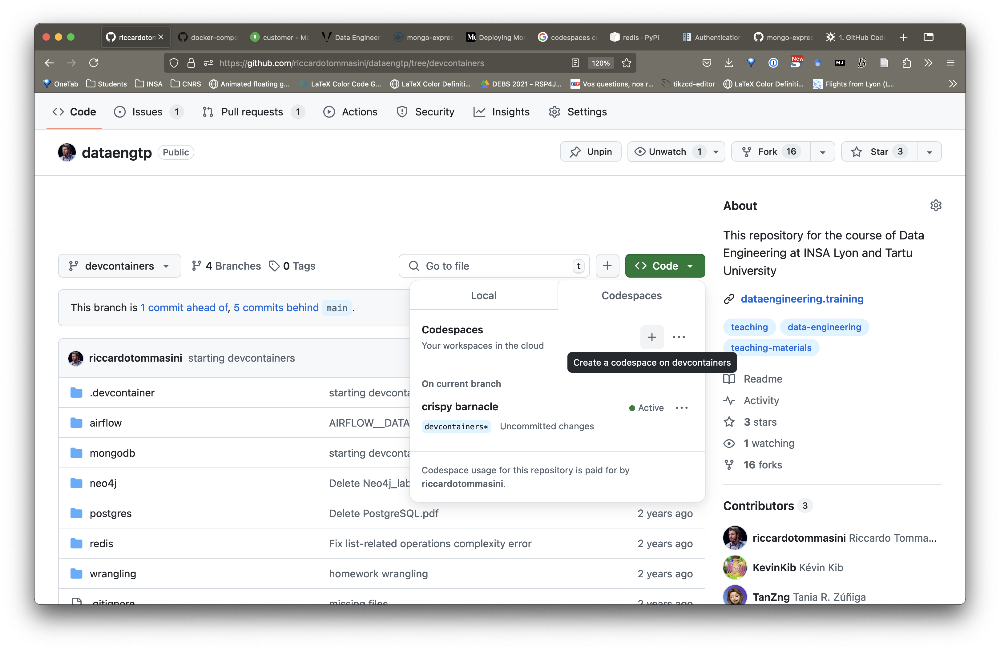

# IST Data Base and Data Mining Lab Repo

### The Relational models using PostgreSQL

#### [Practice Session slides](https://drive.google.com/file/d/1_SfRoWH07lcdYxV_rVjM5KhcQ-V_4gIO/view?usp=sharing)

# Instructions 

The practice works in Docker using Docker Compose.

You can run it either Locally (as we saw in the docker lecture) or with [Github Codespace](https://30daysof.github.io/data-science-day/week-2/1-codespaces/)

### Locally

- Pull the latest version of this repository
- cd into the .devcontainer folder
- run docker compose
  - you can use Visualstudio Code
  - you can use a dockerised installation of Jupyter
  - in the compose there is also a pgAdmin  client container to visualise the content of the database. Accessible locally on port 8888
  
### CodeSpace

Open Codespace as indicated in the images below (use the main branch).
And run docker in the codespace. From here on is the same as locally.




## Native Installation (legacy)

### Windows Users:

- Install Python(3+) and Jupyter Notebook (on windows):
    - [Python, Jupyter](https://medium.com/@kswalawage/install-python-and-jupyter-notebook-to-windows-10-64-bit-66db782e1d02)
    - **Recommended Option**: [Install Anaconda](https://www.datacamp.com/community/tutorials/installing-anaconda-windows)

- Install PostgreSQL on windows:
   - Please, [Download] (https://www.enterprisedb.com/downloads/postgres-postgresql-downloads) and Install PostgreSQL for all platforms
   - Follow this tutorial (https://www.postgresqltutorial.com/install-postgresql/) for more details (Windows installation).

### For Linux users:
- [For installing Anaconda on Linux](https://www.digitalocean.com/community/tutorials/how-to-install-anaconda-on-ubuntu-18-04-quickstart)
   - Then, you can execute the command $ jupyter notebook to launch Jupyter notebook on your Linux machine.
- If you want to install PostgreSQL on Linux:
   - [Tutorial](https://www.postgresqltutorial.com/install-postgresql-linux/)

### Docker users

Simply clone the repository and run

```docker-compose up``


The following docker compose file will build the notebook container which includes all the required dependencies.
Services are also exposed to the host network so you can connect to the via localhost


- [Open Jupyter](http://127.0.0.1:8888/)


```yaml
version: "3"

services:
  postgres:
    image: postgres
    restart: always
    ports:
        - 5432:5432
    environment:
      - POSTGRES_HOST_AUTH_METHOD=trust
  notebook:
    build: notebook/
    ports:
      - 8888:8888
    volumes:
       - ./:/home/jovyan/work/data
    environment:
      - GRANT_SUDO=yes
```     
